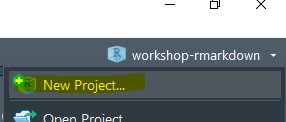
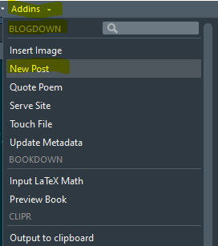

## Load Packages

```{r message=FALSE, warning=FALSE}
library(tidyverse)
```


Is Blogdown Loaded?

```{r}
library(blogdown)
```

If not, follow the installation instructions

``` r
install.packages("blogdown")
# then, library(blogdown)
```

## Get Started

1. Open A New RStudio Project
1. Choose "New Directory"
1. Choose "Website using blogdown"
1. Choose a directory name and click `Create Project`




&nbsp;


&nbsp;


&nbsp;


## Now Build and Serve the site

The site will show up in the Viewer tab.  See the R console for notes on the URL.


## Add a new blog post to your site




## Read more

- https://bookdown.org/yihui/blogdown/a-quick-example.html
