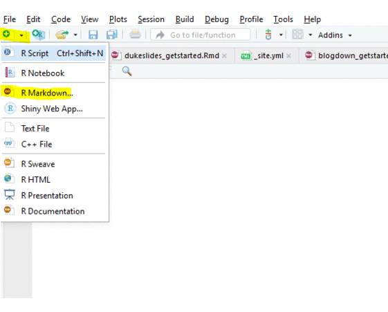

```{r setup, include=FALSE}
knitr::opts_chunk$set(echo = TRUE)
```

1. `File > New File > R Markdown... > From Template > Dashboards`
1. Edit your R Markdown file
1. Click the "Knit" buton in the script editor to render the document




&nbsp;

## Learn More

[flexdashboards](https://rmarkdown.rstudio.com/flexdashboard/) 

