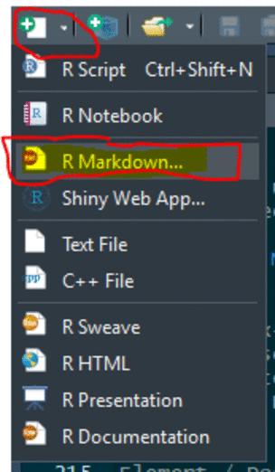

## Load Packages

```{r message=FALSE, warning=FALSE}
library(tidyverse)
```


Are Duke Slides loaded?

```{r}
library(dukeslides)
```

If not, follow the installation instructions

``` r
# install.packages("devtools")
devtools::install_github("libjohn/dukeslides")
```

## Get Started
Create a new R Markdown document from the File menu

In RStudio…

1. `New File -> R Markdown
1. From Template -> Slide template for Duke University {dukeslides}` > OK
1. Edit your R Markdown file
1. Click the "Knit" buton in the script editor to render the document




This will generate a plaintext .Rmd file in the script editor showing each slide separated by `---`.  You must keep the YAML header but you can edit the values in the header.  

Using plain text and R Markdown you can customize the slide template.  Importantly, this template doubles as both a demonstration and documentation.  **Knitting the file will generate slide output as an HTML file** (with supporting files) showing the rendered ouput as a demonstration and documentation.

Edit to your hearts delight.  You cannot mess up the template.  Simply re-execute step one, above, you'll have a new .Rmd file with the demonstration/instructions.


## More Documentation

- [dukeslides](http://www.johnlittle.info/dukeslides/)
- [xaringan](https://slides.yihui.name/xaringan/)


