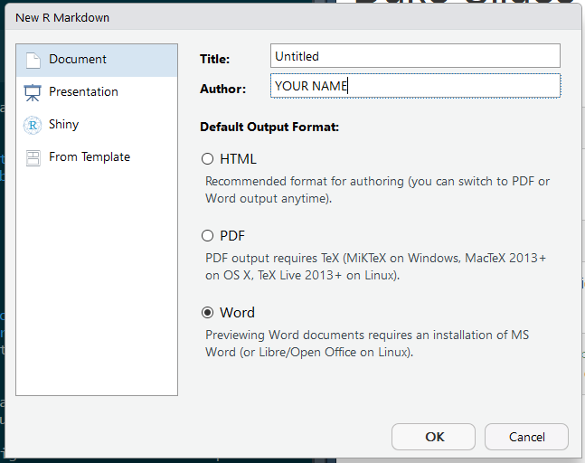

```{r setup, include=FALSE}
knitr::opts_chunk$set(echo = TRUE)
```

Get Started

Create a new R Markdown document from the File Maneu

In RStudio...




1. `New File -> R Markdown -> Document ->Word`
1. Generate some Literate Code
1. Knit (Knit to Word)


The challenge with generate MS Word files is to generate your tables with `kintr::kable`.  There's also a kableExtra package if you need more functionality with editing your tables.

```{r}
knitr::kable(head(cars))
```

