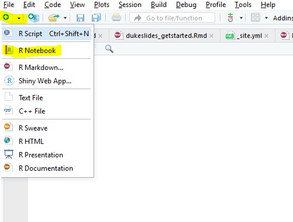
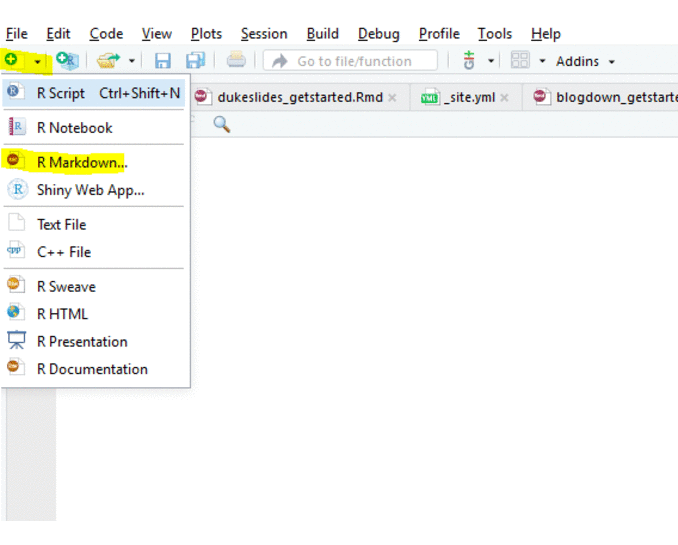

```{r setup, include=FALSE}
knitr::opts_chunk$set(echo = TRUE)
```

## Notebooks

Use R Notebooks for development.  Notebooks are self contained and can be emailed as a single document, like a MS Word file.

1. `File > New File > R Notebook`




&nbsp;

## HTML Documents

Use HTML documents for more fixed content.  HTML Documents will cache better and potentially load faster.

1. `File > New File > R Markdown... > Document > HTML`




&nbsp;

## Learn More

[R Markdown: The Definitive Guide book](https://bookdown.org/yihui/rmarkdown/) by *Yihui Xie, J. J. Allaire, Garrett Grolemund*

