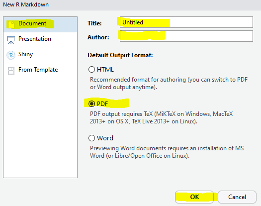

```{r setup, include=FALSE}
knitr::opts_chunk$set(echo = TRUE)
```

Get Started

Create a new R Markdown document from the File Menu

In RStudio...


1. `New File -> R Markdown -> Document ->PDF`
1. Generate some Literate Code
1. Knit (Knit to PDF)




&nbsp;

When implenting images inline, I found the following code works well for PDF documents via R Markdown:

``` r 
 
``` 


The challenge with PDF files is generating your tables with `kintr::kable`.  There's also a kableExtra package if you need more functionality with editing your tables.


```{r}
knitr::kable(head(cars))
```

```{r cars}
knitr::kable(summary(cars))
```

## Including Plots

You can also embed plots, for example:

```{r pressure}
plot(pressure)
```

